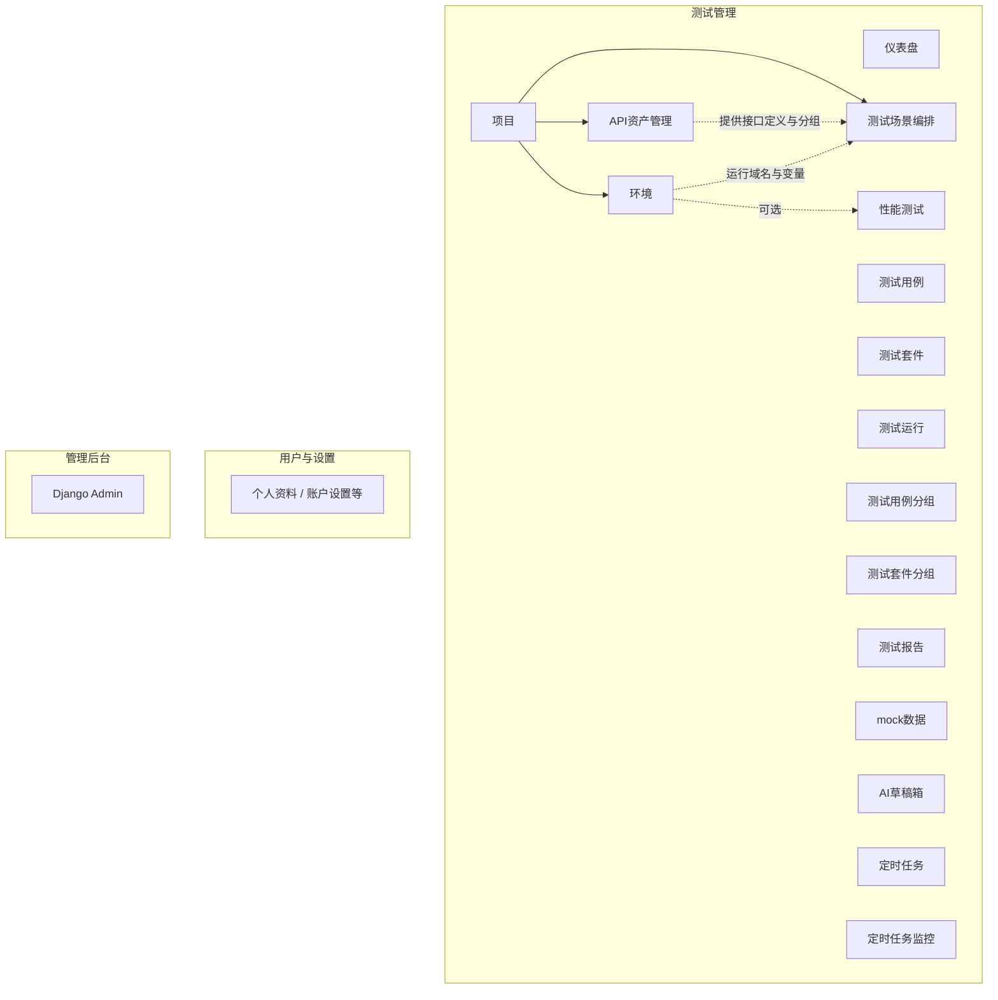
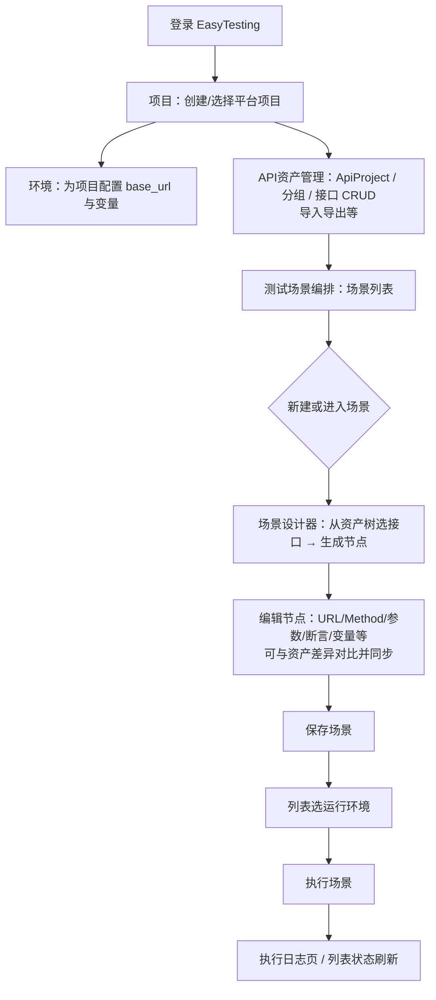
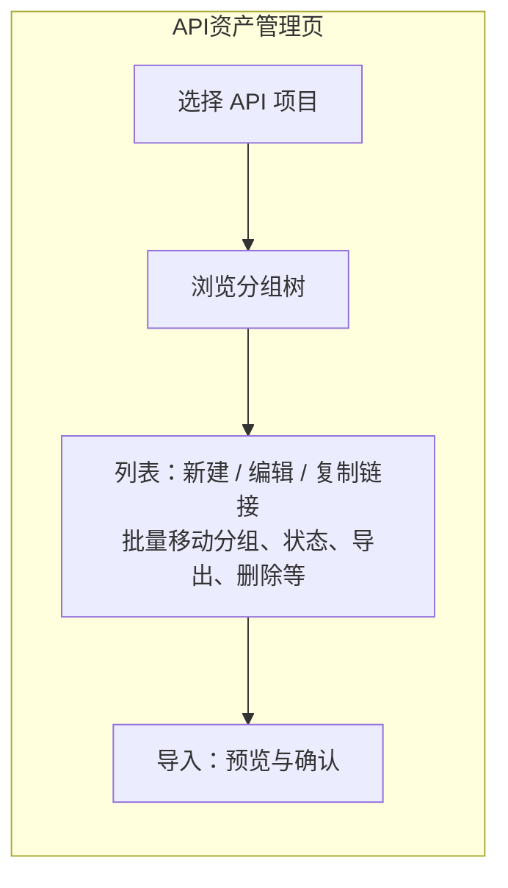
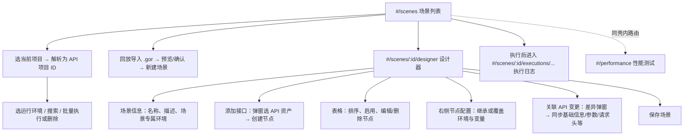
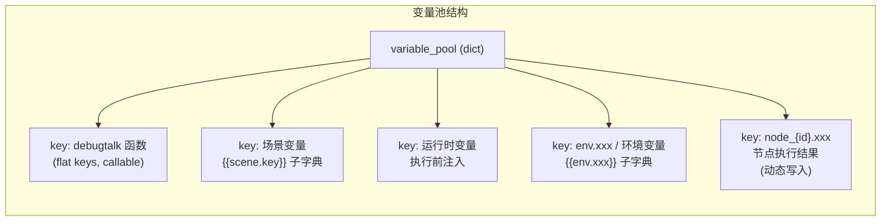
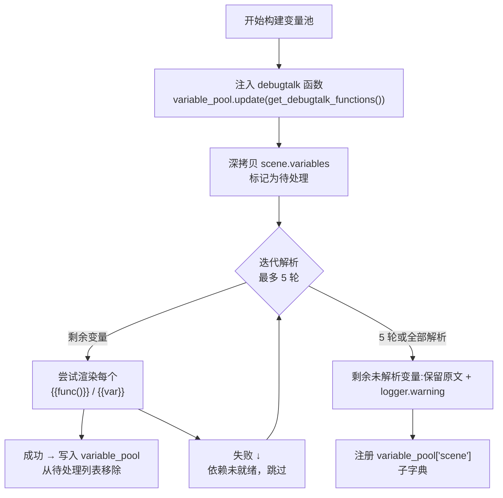
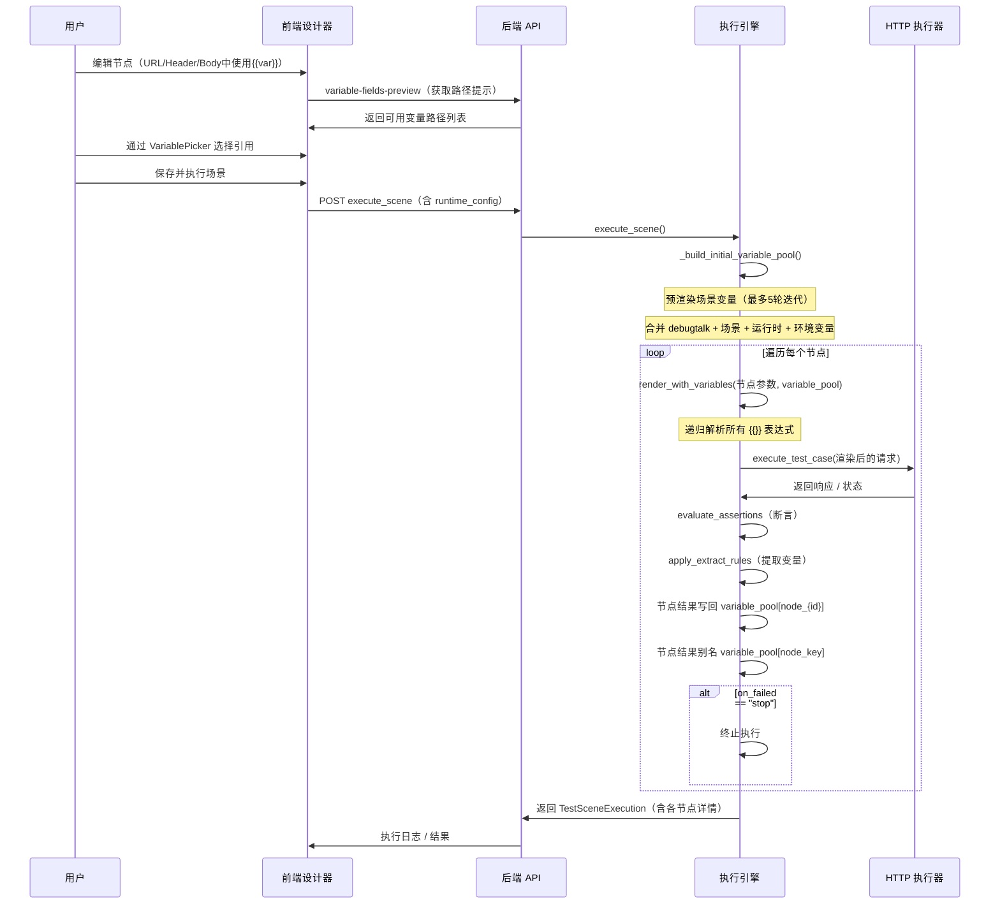
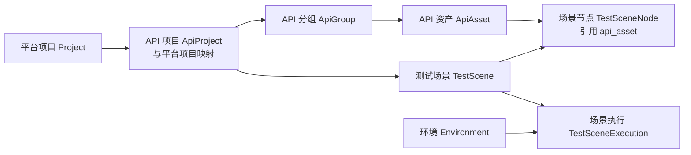

# EasyTesting 平台功能流程说明

本文档梳理 **API 资产管理**、**测试场景编辑（编排）** 及侧边栏相关菜单的关系与流程，依据仓库内 `templates/base.html`、Django 视图与 `frontend/scene-orchestrator` 前端路由整理。

---

## 1. 侧边栏菜单地图

侧边栏在「测试管理」分组下，与本主题强相关的是：**项目 → 环境 → API 资产管理 → 测试场景编排**；同组还有 **性能测试**（与场景共用一套 Vue 静态资源，但业务独立）、以及用例/套件/运行/报告等传统测试能力。



---

## 2. 端到端主流程（从「有接口」到「能跑场景」）

典型顺序：**先在项目管理里建平台项目 → 在环境配置域名/变量 → 在 API 资产管理里维护分组与接口 → 在测试场景编排里组链路与调参 → 选环境执行并看日志**。

场景列表页会提示：无项目时先去「项目管理」；无环境时引导到「环境」页面创建配置。



---

## 3. API 资产管理子流程

API 资产管理为 **Django 模板页**（`/api-asset-manager/`），与 REST 资源 `api-projects`、`api-groups`、`api-assets` 等交互；创建/编辑会跳到独立表单页（如 `/api-assets/create/`、`/api-assets/{id}/edit/`）。场景设计器里的「选择 API 资产」使用 **同一套分组/资产接口**，保证层级一致。



---

## 4. 测试场景编辑（编排）子流程 — Vue 路由

场景编排为嵌入在 `/test-scene-orchestrator/` 的 **Vue SPA**（hash 路由），与后端 `test-scenes`、`test-scene-nodes`、`scene-designer/init` 等配合。



**说明：** `/#/performance` 与场景列表、设计器同属一个前端工程，但压测任务走 `/api/performance/tasks/`，与场景执行引擎不同。

---

## 5. 变量系统：引用、运行与解析机制

变量系统是整个场景编排执行的核心，支撑节点间数据传递、环境切换、动态参数注入等场景。

### 5.1 变量池四层架构

变量池（variable_pool）是一个运行时合并的 Python dict，在执行启动时构建，同一场景内所有节点共享。层叠优先级（高 → 低）：

| 层级 | 来源 | 示例 | 覆盖关系 |
|------|------|------|----------|
| **debugtalk 函数** | `debugtalk.py` 中定义的可调用函数 | `random_str`, `get_timestamp` | 最底层基座 |
| **场景变量** | 场景设计的「变量」配置（`scene.variables`） | 登录 token、用户 ID | 可引用同层其他变量和 debugtalk 函数 |
| **运行时变量** | 执行前传入的运行时覆盖变量（`runtime_config.variables`） | 临时回放/测试用值 | 覆盖同名场景变量 |
| **环境变量** | 所选运行环境的 `variables` | Host、AppKey、Secret | 最高优先级，直接注入顶层 |



### 5.2 场景变量预渲染

`_build_initial_variable_pool()`（`scene_engine.py:717`）在执行开始时执行场景变量的预渲染：

1. 将 `scene.variables` 中的 `{{func()}}` 和 `{{var}}` 模板提前解析
2. 支持**变量间相互引用**（如 varA 引用 varB），使用**最多 5 轮迭代解析**
3. 每轮仅解析依赖已就绪的变量，未就绪的留在下一轮
4. 5 轮后仍未解析的保留原文，记录 `logger.warning`
5. 预渲染完成后，同时注册 `variable_pool["scene"]` 子字典，使 `{{scene.var}}` 和 `{{var}}` **两种引用方式均可工作**



### 5.3 模板渲染与表达式解析

#### 5.3.1 递归渲染 `render_with_variables()`
递归遍历请求参数（dict/list/str），对每个字符串调用 `_render_text_with_variables()`。

```python
def render_with_variables(payload, variable_pool):
    if isinstance(payload, dict):
        return {k: render_with_variables(v, variable_pool) for k, v in payload.items()}
    if isinstance(payload, list):
        return [render_with_variables(item, variable_pool) for item in payload]
    if isinstance(payload, str):
        return _render_text_with_variables(payload, variable_pool)
    return payload
```

#### 5.3.2 文本模板替换 `_render_text_with_variables()`
- 识别 `{{var.path}}` 和 `{{func()}}` 语法
- **整段只有一个模板表达式**（如 `"{{timestamp}}"`）：保留原始类型（返回函数返回值，可能不是 str）
- **字符串中混有模板**（如 `"prefix-{{var}}-suffix"`）：正则替换为字符串，便于拼接 URL/Header

#### 5.3.3 值解析 `_resolve_value()`
- `func()` 后缀 → 从 `variable_pool` 查找 callable 并执行
- `var.path` → `_resolve_from_pool()` 按点号路径逐级查找，支持方括号下标（`data[0].items`）

### 5.4 节点结果写回

节点执行完成后，结果**自动写入变量池**，供后续节点引用（`scene_engine.py:1220-1237`）：

| 写入形式 | Key | 说明 |
|---------|-----|------|
| 主键 | `node_{node.id}` | 使用数据库自增 ID，确保唯一（`ISSUE-08`） |
| 别名 | `{node_key}` | 用户可读的名称，如 `step_1`。若覆盖已有变量则输出 `logger.warning` |

写入的数据结构：
```python
variable_pool["node_{id}"] = {
    "status": "passed/failed",
    "node_key": "step_1",
    "status_code": 200,
    "response": {...},         # 响应 JSON 体
    "headers": {...},          # 响应头
    "request": {...},          # 实际发出的请求
    "assert_results": [...],   # 断言结果详情
    "extracted": {...},        # 提取变量结果
}
```

用户可通过以下路径引用：
- `{{node_5.response.data.token}}` — 按 ID 引用（推荐，防冲突）
- `{{step_1.response.status_code}}` — 按节点 key 引用
- `{{step_1.extracted.my_key}}` — 引用提取规则提取的值

### 5.5 变量引用路径一览

| 引用语法 | 解析目标 | 优先级 |
|---------|---------|--------|
| `{{func()}}` | debugtalk 函数 | 调用返回值 |
| `{{var_name}}` | 场景变量 → 运行时变量 → 环境变量（同名覆盖） | 环境变量最高 |
| `{{scene.var_name}}` | 场景变量（明确前缀） | 仅场景变量 |
| `{{env.var_name}}` | 环境变量（明确前缀） | 仅环境变量 |
| `{{node_{id}.response.xxx}}` | 前序节点响应 | 按 ID |
| `{{node_key.response.xxx}}` | 前序节点响应 | 按别名 |
| `{{node_key.extracted.xxx}}` | 提取规则结果 | 按别名 |

### 5.6 前端变量系统

#### 5.6.1 VariablePicker 组件
`VariablePicker.vue` 是变量引用的选择器组件，嵌入在节点配置面板中：

- **远程路径加载**：调用 `variable-fields-preview/` API，返回当前场景可用的变量路径列表
- **路径分类**：自动按前缀区分 `env.`（环境变量）、`scene.`（场景变量）、其他（节点变量）
- **标签分组**：按类型分为环境变量/场景变量/节点变量三个标签页
- **搜索过滤**：支持按字段名/路径关键字搜索
- **输出格式**：选择后输出 `{{path}}` 形式，直接嵌入 URL/Header/Body 等输入框

#### 5.6.2 variable_fields_preview API
`scene_views.py:365` — 返回变量路径预览：
- `env.{key}` — 环境变量（扁平展开）
- `scene.{key}` — 场景变量（扁平展开）
- `{node_key}.response.{data.xxx/status_code/headers.xxx}` — 节点响应
- `{node_key}.extracted.{key}` — 提取规则命名的变量（已修复 `extract` → `extracted` 路径不一致问题）
- **前置节点过滤**：若传 `current_node_id`，仅返回排序值小于当前节点的节点变量，防止引用尚未执行的后置节点

### 5.7 执行引擎中的变量流转



### 5.8 增强的变量解析错误提示

场景执行时，当模板中的变量路径不存在（如 `{{time}}` 但变量池中无此变量），原本仅抛出笼统的异常，难以定位具体是哪个节点、哪个字段配置的问题。为此引入了字段级上下文包装器 `_render_with_field_context()`：

```python
def _render_with_field_context(field_name, value, variable_pool):
    try:
        return render_with_variables(value, variable_pool)
    except VariableResolveError as exc:
        raise VariableResolveError(f"「{field_name}」中变量解析失败: {exc}")
```

**使用方式**：执行引擎对各字段逐一调用该包装器，传入描述性的 `field_name` 标签：

| 字段标签示例 | 说明 |
|-------------|------|
| `请求头` | 节点配置的请求头键值对 |
| `请求体` | 节点配置的请求体 JSON |
| `请求参数` | 节点配置的查询参数 |
| `断言规则-{{$..code}}` | 具体断言规则中的模板表达式 |
| `环境变量` | 环境配置中的变量 |

**效果**：当变量解析失败时，错误信息从笼统的 `变量路径不存在: time` 提升为精确的 `「断言规则-状态码校验」中变量解析失败: 变量路径不存在: time`，用户可立即定位到问题节点和具体字段。

### 5.9 节点配置 JSON 中的裸模板语法支持

节点配置面板中的**请求体/请求参数/请求头**等 JSON 输入区，用户可直接写入裸 `{{variable}}`、`{{func()}}` 和 `{{node_1.response.data}}` 模板表达式，**无需手动加引号包裹**。

#### 5.9.1 问题背景

JSON 标准要求字符串值必须用双引号包裹，但 `{{}}` 若被双引号包裹时会被视为纯字符串而非模板表达式。用户期望能直接写裸表达式：

```json
// ✅ 用户期望的写法（裸模板）
{"roleIds": [{{roleid}}]}
{"pageSize": {"type": ["{{time1}}"]}}
```

#### 5.9.2 前端解析 `parseJsonStrict()`

`NodeConfigPanel.vue` 中的 `parseJsonStrict()` 函数是一个字符级状态机，在保存 JSON 到后端前做预处理：

```
输入（带裸 {{}}）→ parseJsonStrict() → 输出（标准 JSON，{{}} 被引号包裹）
```

核心逻辑：

| 步骤 | 说明 |
|------|------|
| 1. 尝试标准 JSON.parse | 若已是合法 JSON（如二次保存时 `{{}}` 已被引号包裹），直接返回，不触发状态机 |
| 2. 字符级遍历 | 维护 `inString` 布尔状态，跟踪当前是否在 JSON 字符串内 |
| 3. 转义符处理 | `\` 和后续字符直接透传，不切换 `inString` |
| 4. `"` 切换状态 | 遇到 `"` 翻转 `inString` |
| 5. 裸 `{{}}` 检测 | **仅在 `inString === false` 时**匹配 `{{...}}`，加引号包裹为 `"{{...}}"` |
| 6. 内嵌引号转义 | `{{func("arg")}}` 中的 `"` 自动转义为 `\"`，避免破坏外层 JSON 结构 |

**字符级 vs 正则的关键优势**：旧采用全局正则替换 `/\{\{[^}]*\}\}/g`，会将 `"user{{time}}"` 错误地匹配为 `"user"{{time}}""`（双引号被打断）。字符级状态机通过 `inString` 跟踪，**仅对不在 JSON 字符串内的裸 `{{}}` 加引号**，消除了误伤。

#### 5.9.3 使用示例

以下配置均可直接写在 JSON 编辑器中，保存时会自动转换：

```json
{
  "pageNo": {"value": "1", "type": "{{day()}}"},
  "pageSize": {"value": "10", "type": ["{{time1}}"]},
  "time": {"value": [{{time1}}], "type": "string"},
  "roleIds": [{{roleid}}],
  "headers": {"Authorization": "{{auth_token}}"}
}
```

#### 5.9.4 已知局限

| 场景 | 说明 |
|------|------|
| **数组内的裸模板** | `[{{var}}]` 可正确处理，但数组元素交替裸模板和普通值时需注意 JSON 整体合法性 |
| **`}}` 在模板表达式中** | 若模板值本身包含 `}` 字符（如 `{{#if x>y}}`），当前通过 `indexOf("}}")` 查找结束符可能提前截断 |
| **多层嵌套裸模板** | 如 `{"a": {"b": {{var}}}}` 嵌套结构可正确处理 |

> 建议：保持模板表达式简洁，避免 `}}` 出现在模板值内。若需复杂逻辑，使用前置脚本或 debugtalk 函数替代。

---

## 6. 数据与接口依赖关系



---

## 7. 功能对照表

| 能力 | 入口 | 与场景的关系 |
|------|------|----------------|
| 项目 | 侧边栏「项目」 | 场景列表用平台项目解析出 API 项目，再拉场景与环境 |
| 环境 | 侧边栏「环境」 | 执行与列表运行环境、节点上环境继承都依赖 |
| API 资产管理 | 侧边栏「API 资产管理」 | 接口与分组的来源；设计器「添加接口」直接引用 |
| 测试场景编排 | 侧边栏「测试场景编排」 | 列表 → 设计器 → 保存 → 执行 → 日志 |
| 性能测试 | 侧边栏「性能测试」 | 同前端壳，独立压测 API，与场景编排并行存在 |

---

## 8. 相关文档

- `docs/API资产管理与测试场景编排操作手册.md` — 操作层面说明
- `docs/API资产修改后场景节点同步优化设计文档.md` — 资产变更与节点同步
- `docs/GoReplay回放导入设计文档.md` — 回放导入场景

---

*文档生成说明：流程图使用 Mermaid 语法，可在支持 Mermaid 的 Markdown 预览器（如 VS Code、GitHub、GitLab）中渲染。*

*最近更新：2026-07-02 — 新增 5.8 节（变量解析错误精准定位）、5.9 节（节点配置 JSON 中裸模板语法支持）*
